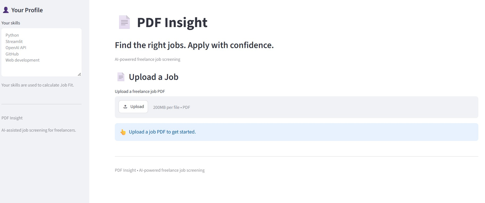
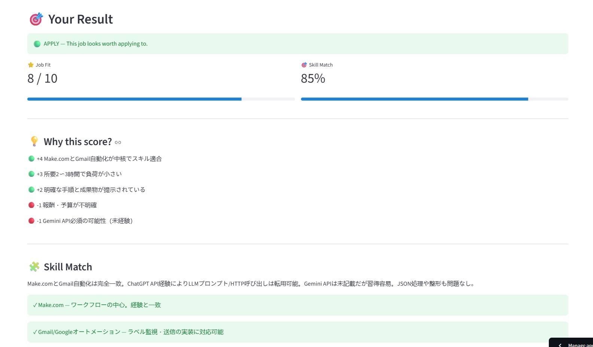
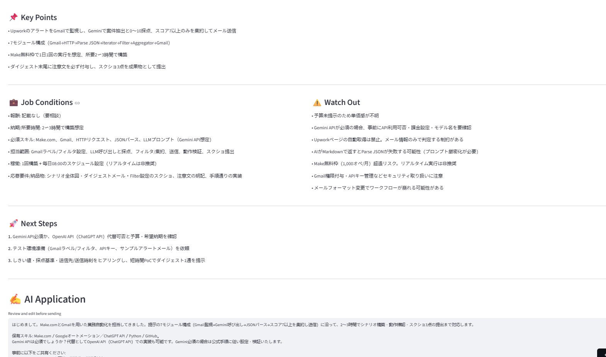

# 📄 PDF Insight

> Find the right jobs. Apply with confidence.

AI-powered freelance job screening tool that analyzes job listings, evaluates skill fit, identifies risks, and generates application messages.

## 🚀 Live Demo

[Try PDF Insight](https://pdf-insight-g3svxjchsc3fbe7rkg68ix.streamlit.app/)

## 💡 What is PDF Insight?

Finding freelance jobs is easy.

Finding the **right** freelance jobs is harder.

PDF Insight helps freelancers quickly evaluate job opportunities before spending time applying.

Upload a job PDF and get:

- ⭐ Job Fit score
- 🎯 Skill Match score
- 💡 Reasons behind the recommendation
- 🧩 Skill comparison
- ⚠️ Potential risks
- 🚀 Recommended next steps
- ✍️ AI-generated application message

## ✨ Features

### Job Screening

Analyze a freelance job listing and receive an overall recommendation:

- 🟢 APPLY
- 🟡 CONSIDER
- 🔴 SKIP

### Skill Matching

Compare the job requirements against your own skills.

### Risk Detection

Identify unclear requirements, potential issues, and important conditions.

### AI Application

Generate a tailored application message based on the job and your actual skills.

### PDF Processing

Extract text directly from uploaded PDF job listings.

## 🛠️ Tech Stack

- Python
- Streamlit
- OpenAI API
- PyMuPDF
- Pydantic
- Git / GitHub

## 🏗️ How It Works

Job PDF → PyMuPDF → Extract Text → OpenAI API → AI Analysis → Job Fit + Skill Match → Application Message

## 🔐 Security

API keys are not stored in the source code.

Local development uses environment variables.

Production deployment uses Streamlit Secrets.

Sensitive files such as `.env` are excluded through `.gitignore`.

## 💻 Run Locally

Clone the repository:

    git clone https://github.com/Builderos-HQ/pdf-insight.git

Enter the project directory:

    cd pdf-insight

Install dependencies:

    pip install -r requirements.txt

Create a `.env` file:

    OPENAI_API_KEY=your_api_key_here

Run Streamlit:

    python -m streamlit run app.py

## 📌 Project Status

**MVP — deployed and functional**

This project is actively being improved as part of my AI development journey.

## 🎯 Roadmap

- [x] PDF job analysis
- [x] Job Fit scoring
- [x] Skill matching
- [x] Risk detection
- [x] AI application generation
- [x] Cloud deployment
- [x] UI / branding improvements
- [ ] Real-world testing
- [ ] Usage analytics
- [ ] Monetization experiments
- [ ] Portfolio optimization

## 👨‍💻 Built With

Built as a hands-on AI product development project.

From idea → code → API integration → GitHub → deployment.
## 👨‍💻 Built With

Built as a hands-on AI product development project.

From idea → code → API integration → GitHub → deployment.

## 📸 Screenshots

### Home

